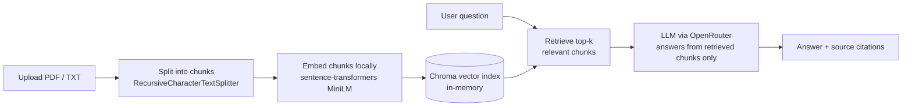

# ⚖️ LexQA — Legal Document Q&A (RAG)

A Retrieval-Augmented Generation (RAG) app that lets an attorney upload contracts,
briefs, or filings and ask questions answered strictly from the content of those
documents — with every answer traceable back to the source clause.

Built with **LangChain**, **Chroma**, and **Streamlit**; LLM calls go through
**OpenRouter** so the demo runs on a free-tier model with no OpenAI billing required.

## Why this instead of just pasting text into ChatGPT?

1. **Grounding.** The model only answers from retrieved chunks of the actual
   document, not from memory — reducing hallucinated case citations or clause
   language, which matters a lot in a legal context.
2. **Traceability.** Every answer is shown alongside the exact chunk (file + page)
   it was built from, so a reviewing attorney can verify it against the source
   instead of taking the model's word for it. The app also exposes its own
   internals in the UI — see [Seeing what's happening under the hood](#seeing-whats-happening-under-the-hood).
3. **Works on documents the model has never seen** — a freshly drafted NDA, an
   internal memo, a client's contract — not just public information baked into
   the model's training data.

## Architecture



**Flow:** document → chunks → embeddings → vector index → (question triggers a
similarity search) → relevant chunks + question go to the LLM → grounded answer,
returned with the chunks it relied on.

## Project layout

```
app.py                          Streamlit app (the whole pipeline)
requirements.txt                Python dependencies
packages.txt                    System packages for Streamlit Cloud (tesseract, poppler — for OCR)
.github/workflows/ci.yml        CI: installs deps, compiles, import smoke test
.env.example                    Template for local secrets — copy to .env
.streamlit/secrets.toml.example Template for Streamlit Cloud secrets
.devcontainer/devcontainer.json GitHub Codespaces config — zero local install needed
sample_docs/sample_nda.txt      Fictional NDA for instant testing
```

## Setup

```bash
python -m venv .venv
source .venv/bin/activate        # Windows: .venv\Scripts\activate
pip install -r requirements.txt

cp .env.example .env             # then edit .env and paste in your key
```

Get a free API key at [openrouter.ai/keys](https://openrouter.ai/keys) — no
payment method required for free-tier models.

```bash
streamlit run app.py
```

Open the local URL Streamlit prints, upload `sample_docs/sample_nda.txt`, and
ask something like *"What is the term of this agreement?"* or *"What law
governs disputes?"*

No local Python? Open this repo in **GitHub Codespaces** instead (the `Code`
button → `Create codespace`) — the included `.devcontainer` installs
everything automatically and forwards port 8501 for you.

## Seeing what's happening under the hood

There's no separate database file or admin panel — Chroma runs **in-memory**
inside the app process itself, so the app surfaces its own internals directly
in the UI instead:

- **📚 Indexed chunks** — appears after you upload a document. Shows every
  chunk the text splitter produced and that got embedded into the vector
  store. This *is* "the database" — there's nothing else to go look at.
- **🔍 How this answer was built** — appears under every answer. Shows the
  exact top-k chunks the similarity search retrieved for that question, the
  literal system prompt sent to the LLM with `{context}` filled in, and the
  model's raw response. This is the whole RAG trick laid bare: retrieval is
  just a search, augmentation is just string concatenation into a prompt.

## Handling API keys securely (this repo is public)

- The key lives only in a local **`.env`** file, loaded via `python-dotenv`.
  `.env` is listed in `.gitignore`, so it never gets committed — only
  `.env.example` (a template with no real value) is tracked.
- The app reads the key from `os.getenv("OPENROUTER_API_KEY")`, never hardcodes
  it, and refuses to start with a clear error if it's missing.
- For the hosted deployment (below), the key is entered into **Streamlit
  Community Cloud's Secrets manager**, not into any file in the repo. The app
  falls back to `st.secrets["OPENROUTER_API_KEY"]` when there's no `.env`.
- `.streamlit/secrets.toml` (the *real* one, if you ever create it locally to
  test cloud secrets) is also gitignored.

If a key is ever committed by mistake, rotating it on OpenRouter's dashboard is
required — removing it from a later commit doesn't remove it from git history.

## Deploying to Streamlit Community Cloud

1. Push this repo to GitHub (already done if you're reading this on GitHub).
2. Go to [share.streamlit.io](https://share.streamlit.io), connect the repo,
   pick the branch and `app.py` as the entry point.
3. In the app's **Settings → Secrets**, paste:
   ```toml
   OPENROUTER_API_KEY = "your_real_key_here"
   ```
4. Deploy. No key ever touches the git history.

GitHub notifies Streamlit Cloud immediately on every push (verified via the
repo's webhook delivery log — 200 OK every time), but in practice that
notification doesn't reliably make the running app pick up the new code by
itself on the free tier. Treat **⋮ → Reboot app** as a normal step after
pushing, not just a troubleshooting fallback — push, then reboot, then check.
That's a quirk of Streamlit Community Cloud itself, not something fixable
from the GitHub side. For fast iteration, editing in Codespaces or locally
(instant hot-reload on save, no push/reboot cycle at all) is a much tighter
loop than pushing to Cloud for every small change — treat the Cloud deploy as
"publish," not "test."

## Design decisions & trade-offs

- **In-memory Chroma, no persistence** — keeps the demo simple and stateless;
  each upload builds a fresh vector index (with a unique collection name to
  avoid collisions across reruns). Trade-off: nothing survives a page refresh.
  A "document library" would need `persist_directory` or a hosted vector DB.
- **Local embeddings (`all-MiniLM-L6-v2`)** — free, fast enough for a demo, and
  keeps document *content* off any embeddings API. The LLM call itself still
  sends retrieved chunks to OpenRouter's model provider — worth flagging
  explicitly, since a real firm would need a data-processing agreement (or a
  self-hosted model) before doing that with privileged material.
- **Deterministic retrieval chain (`create_retrieval_chain` +
  `create_stuff_documents_chain`) instead of agentic RAG.** As of LangChain
  1.0, the framework's default RAG pattern is *agentic*: give the LLM a
  retriever wrapped as a tool (`create_agent` + `create_retriever_tool`) and
  let it decide whether/when to search. The deterministic chain used here
  now lives in the `langchain-classic` package. That's a deliberate choice,
  not a compatibility shortcut: for a legal document review tool, "always
  retrieve before answering, every time" is more auditable than an agent
  that might decide a question doesn't need a document lookup. Both patterns
  are current and supported — agentic retrieval is a natural next step if
  this expands to multi-tool workflows (e.g. "search this doc, then look up
  the cited statute").
- **Temp files are deleted immediately after loading** — uploaded documents
  are written to a temp file only so `PyPDFLoader`/`TextLoader` can read them,
  then removed. For a law firm's client documents, not leaving copies on disk
  is a small but real detail.
- **`k=4`, `chunk_size=800`** — tuned for short-to-medium documents like NDAs
  and briefs; larger filings would likely want bigger `k` or a reranking step.
- **`openrouter/free` instead of a pinned free-tier model slug.** Hardcoding
  a specific model (e.g. `meta-llama/llama-3.1-8b-instruct:free`) broke this
  app in testing when OpenRouter discontinued that model's free tier —
  `openrouter/free` is OpenRouter's own router that auto-selects among
  whatever free models are currently available, so the app doesn't silently
  break the next time a specific slug rotates out. Pin an exact model via
  `OPENROUTER_MODEL` if you want deterministic behavior instead.
- **Chroma's anonymized telemetry is disabled** (`ANONYMIZED_TELEMETRY=False`)
  — appropriate for a tool meant to hold legal documents, and it also avoids
  a real hang observed when that outbound telemetry call gets blocked by a
  restrictive network.
- **OCR fallback for scanned PDFs.** Law firms deal in scanned exhibits and
  filings all the time — PDFs that are really just page images with no text
  layer. When `PyPDFLoader` extracts no text from a PDF, the app rasterizes
  each page (`pdf2image`/poppler) and runs OCR (`pytesseract`/tesseract),
  then indexes the recovered text (chunks are tagged `ocr: True`). The system
  binaries come from `packages.txt` on Streamlit Cloud; if they're ever
  missing, the file is reported as unreadable rather than crashing the app.
  Trade-off: OCR is slower and imperfect (recognition errors on poor scans),
  so it's a fallback, not the default path.

## Roadmap (what "expand later" could look like)

- Persistent, multi-document vector store shared across sessions (a real
  "matter library"), with per-client/per-matter access control.
- Conversational memory — a history-aware retriever so follow-up questions
  ("what about the arbitration clause?") work without restating context.
- Hybrid retrieval (BM25 + embeddings) for exact-term recall on defined terms
  and statute citations, where embeddings alone can miss precise wording.
- Swap the free OpenRouter model for a stronger one, or a self-hosted model,
  for firms with data-residency or confidentiality requirements.
- An evaluation harness (e.g. RAGAS) to track answer faithfulness and
  retrieval relevancy as the prompt/chunking strategy changes.
- `.docx` support for Word filings (OCR for scanned PDFs is now built in).

## Disclaimer

This is a portfolio/demo project. It is **not legal advice**, has not been
audited, and the public demo deployment should never be used with real
client, privileged, or confidential documents.

## License

MIT — see [LICENSE](LICENSE).
